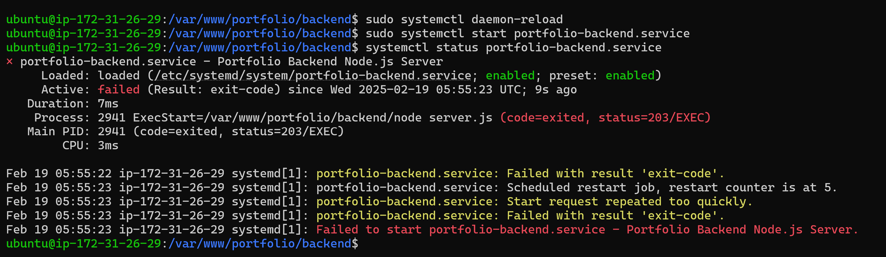
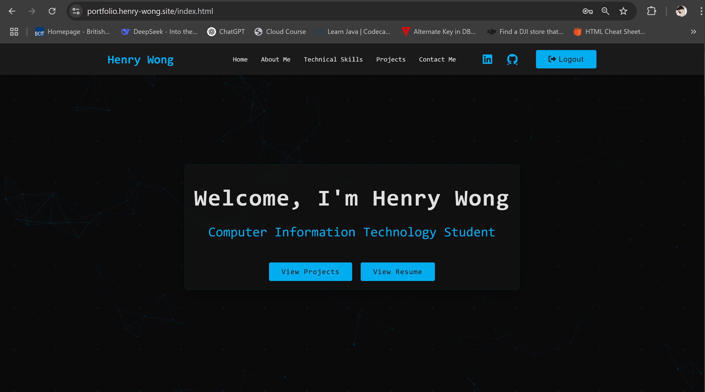
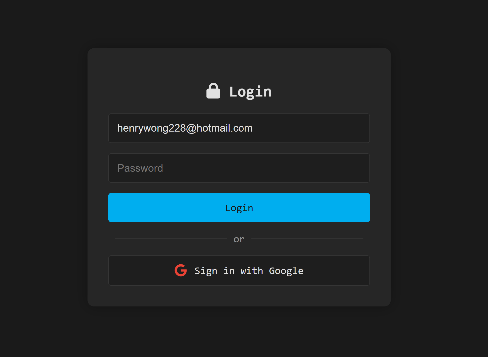
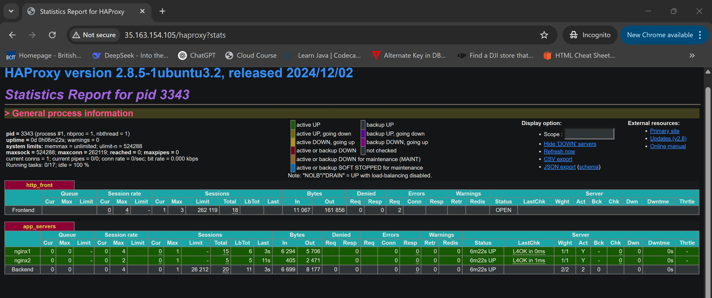
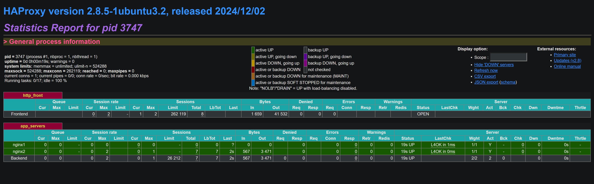
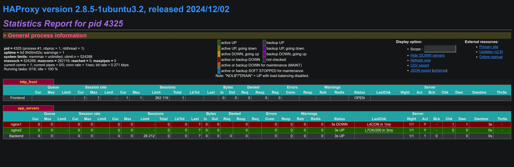
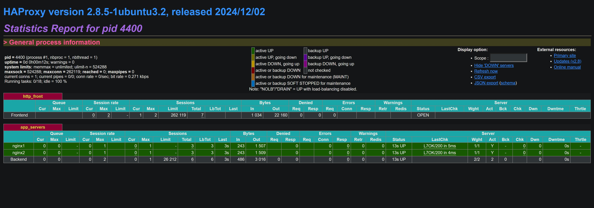

# Part 1: Research-and-Deployment-of-a-Professional-Portfolio-Web-Server
In this assignment, I researched the Caddy web server, deployed it locally and on the cloud, and build my professional portfolio website. The portfolio showcases a professional resume and at least two completed projects.


## Part 2: Local Deployment and Portfolio Setup Report

### Local Deployment Process

#### Step 1: Installing Caddy
I followed these steps to install Caddy on my Windows machine:

1. Visited the Caddy Releases Page on Github (https://github.com/caddyserver/caddy/releases)
2. Found the latest release and expanded the "Assets" section
3. Downloaded caddy_2.9.1_windows_amd64.zip
4. Extracted the ZIP file
5. Copied caddy.exe from the extracted folder
6. Navigated to C:\Windows\System32
7. Pasted caddy.exe (provided administrator permissions when prompted)
8. Opened Command Prompt and verified installation with `caddy run`


>[!IMPORTANT]
>Make sure to click yes here


#### Step 2: Basic Caddy Configuration
Created my Caddyfile with the following configuration:
```
:2000 {
    root * "C:/Users/henry/Documents/BCIT CIT TERM 3/ACIT 3475 Web Server Admin/Project 1/Portfolio website"
    file_server
    handle /api/* {
        reverse_proxy localhost:3000
    }
}
```

Here's what each part does:
- `:2000` - Sets the port where the server listens
- `root *` - Specifies the root directory for serving files
- `file_server` - Enables Caddy's built-in file server
- `handle /api/*` - Creates a route for API requests
- `reverse_proxy localhost:3000` - Forwards API requests to a local backend server

This configuration allows me to:
1. Serve static files from my portfolio directory
2. Handle API requests through a separate backend service
3. Test everything locally on port 2000

#### Verifying Caddy Server Deployment
I verified that Caddy was running correctly by inspecting the server headers:

1. Opened my website at http://localhost:2000/
2. Used browser Developer Tools (F12)
3. Went to the Network tab
4. Reloaded the page to capture requests
5. Inspected the response headers

Here's what the network inspection revealed:
```
Request URL: http://localhost:2000/
Request Method: GET
Status Code: 200 OK
Remote Address: [::1]:2000
Server: Caddy
```


This confirms that Caddy is properly serving my website.

#### Step 3: Portfolio Development
Built my portfolio website using:
- HTML5 & EJS templates
- CSS3 for styling
- JavaScript for interactivity


### Challenges and Solutions

1. **Port Binding Issues**
   - Challenge: Initial port 80/443 conflicts
   - Solution: Switched to port 2000 for development


### Conclusion
Successfully deployed Caddy locally and set up a basic portfolio website structure. The process helped me understand web server configuration and deployment workflows.

## Part 3: Cloud Deployment and Domain Setup

### Step 1: Preparing the Cloud Environment
1. Created AWS EC2 instance:
   - Ubuntu Server 22.04 LTS
   - t2.micro (free tier)
   - Selected existing key pair
   - Security Groups:
     - HTTP (80)
     - HTTPS (443)
     - SSH (22)

2. Connected to instance:
```bash
ssh -i existing-key.pem ubuntu@[ec2-ip]
```

### Step 2: Setting Up the Web Server and Domain
1. Installed Caddy and followed welcome page instructions:
```bash
sudo apt update && sudo apt install -y caddy
```

2. Domain Registration and DNS Setup:
   - Purchased 'henry-wong.site' domain from Namecheap
   - Created AWS Route 53 hosted zone
   - Added A record pointing to EC2 IP
   - Configured nameservers in Namecheap to point to Route 53

3. Installed Node.js :
```bash
sudo apt install -y nodejs

# Verify installation
node --version
npm --version
```

4. Followed Caddy's welcome page setup guide:
   - Created web root: `sudo mkdir -p /var/www/html`
   - Set permissions: `sudo chown -R ubuntu:ubuntu /var/www/html`
   - Modified Caddyfile at `/etc/caddy/Caddyfile`:
     - Replaced `:80` with `portfolio.henry-wong.site`
     - Set root to `/var/www/html`
   - Reloaded config: `sudo systemctl reload caddy`

5. Cloned portfolio:
```bash
cd /var/www/html
git clone [my-repository] .
```

6. Configured Caddyfile for domain and automatic SSL:
```
portfolio.henry-wong.site {
    root * /var/www/html
    file_server
    handle /api/* {
        reverse_proxy localhost:3000
    }
}
```

### Step 3: Configuring the Server
1. Backend setup:
```bash
cd backend
npm install
```

2. Created Node.js service:
```bash
# /etc/systemd/system/portfolio-backend.service
[Unit]
Description=Portfolio Backend Node.js Server
After=network.target

[Service]
Type=simple
User=ubuntu
WorkingDirectory=/var/www/html/backend
ExecStart=/usr/bin/node /var/www/html/backend/server.js
Restart=on-failure
Environment=NODE_ENV=production

[Install]
WantedBy=multi-user.target
```

3. Enabled and started the service:
```bash
sudo systemctl enable portfolio-backend
sudo systemctl start portfolio-backend
sudo systemctl status portfolio-backend  
```

### Challenges and Solutions
1. **Secure Connection Issues**
   - Challenge: Caddy not detecting index file
   - Solution: Recreated directory structure following Caddy's documentation

2. **Missing Dependencies**
   - Challenge: Backend dependencies missing after git clone
   - Solution: Reinstalled with npm install
   


3. **Server Management**
   - Challenge: Figure out how to keep server.js running
   - Solution: Implemented systemd service

### Final Deployment
Successfully deployed at https://portfolio.henry-wong.site with:
- Secure HTTPS connection
- Running Node.js backend
- Proper domain resolution through Route 53




### Conclusion
The cloud deployment phase successfully achieved all tasks. AWS EC2 provided the hosting environment, Route 53 handled domain management, and Caddy managed HTTPS certification. The implementation of systemd services ensures reliable backend operation. This deployment demonstrates effective use of cloud infrastructure and web server technologies.


# Part 2: High-Availability Portfolio with OAuth and GitHub Contributions

## Step 1: OAuth Configuration and Implementation
1. Created Google OAuth credentials in .env:
   ```bash
   # .env configuration
   GOOGLE_CLIENT_ID=your-client-id.apps.googleusercontent.com
   GOOGLE_CLIENT_SECRET=your-client-secret
   GOOGLE_CALLBACK_URL=http://portfolio.henry-wong.site/auth/google/callback
   ```

   Using .env files keeps credentials secure and separate from the codebase.

2. Implemented OAuth routes in Express:
   ```javascript
   // auth.js
   passport.use(new GoogleStrategy({
       clientID: process.env.GOOGLE_CLIENT_ID,
       clientSecret: process.env.GOOGLE_CLIENT_SECRET,
       callbackURL: process.env.GOOGLE_CALLBACK_URL
   }, (accessToken, refreshToken, profile, done) => {
       return done(null, {
           id: profile.id,
           email: profile.emails[0].value,
           name: profile.displayName
       });
   }));
   ```

3. Added authentication middleware:
   ```javascript
   // server.js
   function requireAuth(req, res, next) {
       if (req.isAuthenticated() || req.session.userId) {
           return next();
       }
       return res.status(401).json({ message: 'Authentication required' });
   }
   ```



### Security Enhancements

- OAuth tokens and client secrets are stored in a separate .env file. This ensures that sensitive credentials are not hard-coded in the source code and remain out of version control.

- Using a .env file allows for easy updates and better security practices, as tokens are loaded during runtime without exposing them in the repository.

- Role-based access control is implemented to ensure that authenticated users only access permitted resources based on their assigned roles.

## Step 2: GitHub Widget Integration
1. Added GitHub calendar widget script to index.html:
   ```html
   <script type="module" defer src="https://cdn.jsdelivr.net/gh/imananoosheh/github-contributions-fetch@latest/github_calendar_widget.js"></script>
   ```

2. Created GitHub activity section in index.html:
   ```html
   <section id="github-activity" class="section github-activity-section" data-aos="fade-up">
     <div class="container">
       <h2>GitHub Contributions</h2>
       <div class="github-calendar-container">
         <div id="calendar-component" 
              username="henrywong1" 
              theme-color="#00AEEF"
              background-color="#262626">
         </div>
       </div>
     </div>
   </section>
   ```

3. Added calendar container styling:
   ```css
   .github-calendar-container {
     width: 100%;
     max-width: 1100px;
     margin: 0 auto;
     padding: 40px;
     background: linear-gradient(145deg, var(--secondary-color), #2b2b2b);
     border-radius: 12px;
     box-shadow: 0 4px 15px rgba(0, 0, 0, 0.2);
     border: 1px solid rgba(0, 174, 239, 0.1);
   }

   #calendar-component {
     --calendar-bg: transparent;
     --calendar-text: var(--text-color);
     --calendar-grade-0: rgba(255, 255, 255, 0.05);
     width: 100%;
     max-width: 1000px;
     margin: 0 auto;
     transform: scale(0.95);
     transform-origin: center;
   }
   ```


Key Features:
- Loads widget from CDN for better performance
- Matches portfolio's color scheme
- Responsive design that works on all screen sizes
- Automatic updates with GitHub activity
- Smooth fade-in animation on scroll


## Step 3: High-Availability Setup
1. Deployed Nginx instances:
   ```bash
   # Install Nginx on both servers
   sudo apt update
   sudo apt install nginx
   
   # Configure Nginx
   sudo nano /etc/nginx/sites-available/portfolio
   sudo ln -s /etc/nginx/sites-available/portfolio /etc/nginx/sites-enabled/
   sudo nginx -t
   sudo systemctl restart nginx
   ```

2. Configured HAProxy load balancer:

   ```haproxy
   global
      # Logging configuration
      log /dev/log    local0
      log /dev/log    local1 notice
      
      # Security and process management
      chroot /var/lib/haproxy
      stats socket /run/haproxy/admin.sock mode 660 level admin
      stats timeout 30s
      user haproxy
      group haproxy
      daemon

      # SSL Configuration
      ca-base /etc/ssl/certs
      crt-base /etc/ssl/private
      ssl-default-bind-ciphers ECDHE-ECDSA-AES128-GCM-SHA256:ECDHE-RSA-AES128-GCM-SHA256:ECDHE-ECDSA-AES256-GCM-SHA384
      ssl-default-bind-ciphersuites TLS_AES_128_GCM_SHA256:TLS_AES_256_GCM_SHA384
      ssl-default-bind-options ssl-min-ver TLSv1.2 no-tls-tickets

   defaults
      # Basic HTTP settings
      log     global
      mode    http
      option  httplog
      option  dontlognull
      
      # Timeout settings
      timeout connect 5000
      timeout client  50000
      timeout server  50000
      
      # Error pages
      errorfile 400 /etc/haproxy/errors/400.http
      errorfile 403 /etc/haproxy/errors/403.http
      errorfile 408 /etc/haproxy/errors/408.http
      errorfile 500 /etc/haproxy/errors/500.http
      errorfile 502 /etc/haproxy/errors/502.http
      errorfile 503 /etc/haproxy/errors/503.http
      errorfile 504 /etc/haproxy/errors/504.http

   frontend http_front
      bind *:80
      default_backend app_servers
      stats uri /haproxy?stats

   backend app_servers
      balance roundrobin
      cookie SERVERID insert indirect nocache
      server nginx1 35.89.74.218:5050 check cookie nginx1
      server nginx2 34.222.129.247:5050 check cookie nginx2
   ```

### Configuration Breakdown:

1. **Global Section**:
   - Configures system-wide settings
   - Sets up logging to local syslog
   - Defines security parameters and SSL settings
   - Establishes admin socket for management

2. **Defaults Section**:
   - Sets HTTP mode for all services
   - Configures timeout values for connections
   - Defines error page locations
   - Enables logging of HTTP requests

3. **Frontend Section**:
   - Listens on port 80 for incoming traffic
   - Provides statistics page at /haproxy?stats
   - Routes requests to backend servers

4. **Backend Section**:
   - Implements round-robin load balancing
   - Enables session persistence with cookies
   - Defines two Nginx servers with health checks
   - Includes server-specific cookie settings

This configuration provides high availability and load balancing while maintaining session persistence for user sessions.


## Load Balancing Algorithm Tests


### Round Robin Testing (Default)
```bash
# Run this command multiple times
curl -I http://35.163.154.105
```


Expected Output:
- Should alternate between:
  - Server: nginx1
  - Server: nginx2

### Least Connections Algorithm
```haproxy
backend app_servers
    balance leastconn
    server nginx1 35.89.74.218:5050 check
    server nginx2 34.222.129.247:5050 check
```
Testing showed traffic being routed to servers with fewer active connections:
```
This is ApacheBench, Version 2.3 <$Revision: 1903618 $>
Copyright 1996 Adam Twiss, Zeus Technology Ltd, http://www.zeustech.net/
Licensed to The Apache Software Foundation, http://www.apache.org/

Benchmarking portfolio.henry-wong.site (be patient)
Completed 100 requests
Completed 200 requests
Completed 300 requests
Completed 400 requests
Completed 500 requests
Completed 600 requests
Completed 700 requests
Completed 800 requests
Completed 900 requests
Completed 1000 requests
Finished 1000 requests


Server Software:        Caddy
Server Hostname:        portfolio.henry-wong.site
Server Port:            80

Document Path:          /
Document Length:        0 bytes

Concurrency Level:      50
Time taken for tests:   0.189 seconds
Complete requests:      1000
Failed requests:        0
Non-2xx responses:      1000
Total transferred:      171000 bytes
HTML transferred:       0 bytes
Requests per second:    5279.02 [#/sec] (mean)
Time per request:       9.471 [ms] (mean)
Time per request:       0.189 [ms] (mean, across all concurrent requests)
Transfer rate:          881.56 [Kbytes/sec] received

Connection Times (ms)
              min  mean[+/-sd] median   max
Connect:        0    2   0.9      2       6
Processing:     2    7   1.7      7      12
Waiting:        0    7   1.7      7      12
Total:          3    9   1.5      9      13

Percentage of the requests served within a certain time (ms)
  50%      9
  66%     10
  75%     10
  80%     10
  90%     11
  95%     11
  98%     12
  99%     13
 100%     13 (longest request)
 ```

### Source IP Hashing Algorithm
```haproxy
backend app_servers
    balance source
    server nginx1 35.89.74.218:5050 check
    server nginx2 34.222.129.247:5050 check
```
Consistent routing to the same backend when accessed from the same IP:


### Weighted Round Robin Algorithm
```haproxy
backend app_servers
    balance roundrobin
    server nginx1 35.89.74.218:5050 check weight 3
    server nginx2 34.222.129.247:5050 check weight 1
```
Server nginx1 received approximately three times as many requests:


### Part 2: Health Check Configuration

#### Basic Health Checks
```haproxy
backend app_servers
    balance roundrobin
    server nginx1 35.89.74.218:5050 check
    server nginx2 34.222.129.247:5050 check
```

#### Advanced Health Check Settings
```haproxy
backend app_servers
    server nginx1 35.89.74.218:5050 check inter 2000 rise 3 fall 2
    server nginx2 34.222.129.247:5050 check inter 2000 rise 3 fall 2
```

Testing Process:
1. Stopped Nginx on one backend:
```bash
sudo systemctl stop nginx
```
2. Observed server marked as DOWN in HAProxy stats:


3. Restarted Nginx:
```bash
sudo systemctl start nginx
```
4. Server marked as UP after passing health checks:


## Simulated Traffic Testing

To test the portfolio under simulated traffic, you can use tools like ApacheBench (ab). For example, run the following command to send 1000 requests with a concurrency level of 50:

```bash
sudo apt install apache2-utils

ab -n 1000 -c 50 http://portfolio.henry-wong.site/
```

This will simulate heavy load on your server and help you identify performance bottlenecks.
  
## Benchmark Results

```
ApacheBench, Version 2.3 <$Revision: 1903618 $>
Copyright 1996 Adam Twiss, Zeus Technology Ltd, http://www.zeustech.net/
Licensed to The Apache Software Foundation, http://www.apache.org/

Benchmarking portfolio.henry-wong.site (be patient)
Completed 100 requests
Completed 200 requests
Completed 300 requests
Completed 400 requests
Completed 500 requests
Completed 600 requests
Completed 700 requests
Completed 800 requests
Completed 900 requests
Completed 1000 requests
Finished 1000 requests

Server Software:        Caddy
Server Hostname:        portfolio.henry-wong.site
Server Port:            80

Document Path:          /
Document Length:        0 bytes

Concurrency Level:      50
Time taken for tests:   0.213 seconds
Complete requests:      1000
Failed requests:        0
Non-2xx responses:      1000
Total transferred:      171000 bytes
HTML transferred:       0 bytes
Requests per second:    4689.11 [#/sec] (mean)
Time per request:       10.663 [ms] (mean)
Time per request:       0.213 [ms] (mean, across all concurrent requests)
Transfer rate:          783.05 [Kbytes/sec] received

Connection Times (ms)
              min  mean[+/-sd] median   max
Connect:        0    2   0.8      2       4
Processing:     1    8   2.0      8      16
Waiting:        1    8   2.0      8      14
Total:          2   10   1.9     10      19

Percentage of the requests served within a certain time (ms)
  50%     10
  66%     11
  75%     11
  80%     12
  90%     12
  95%     13
  98%     15
  99%     16
 100%     19 (longest request)
```


## Performance Benefits of HAProxy Setup

**HAProxy enhances the performance and reliability of the portfolio in several ways:**

- **Load Distribution**: It evenly distributes incoming traffic among multiple backend servers using algorithms such as round-robin. This prevents any single server from becoming a bottleneck.

- **High Throughput & Low Latency**: By managing connections efficiently, HAProxy supports a high rate of requests with minimal response time, as demonstrated by the benchmark results.

- **Health Monitoring**: Continuous health checks allow HAProxy to route traffic only to healthy servers, improving system availability and stability during high load.

- **Session Persistence**: Sticky sessions (using cookies such as SERVERID) ensure that a user’s session consistently routes to the same server, which is crucial for applications with login functionality and personalized content.

- **Scalability**: The ability to add more backend servers easily allows the system to scale out as load increases, ensuring long-term performance and flexibility.

**Reference**: https://medium.com/@raoshahzaib/what-is-haproxy-and-its-benefits-which-companies-are-using-it-edae79f7d263

## Troubleshooting: 

### Sticky Sessions

If login or other session-dependent features aren’t working, it could be due to session data being lost when requests hit different backend servers. This happens when the initial request and any subsequent callbacks are processed by different servers.

Fix: Enable sticky sessions in HAProxy.cfg
```
backend aws_backends
    balance roundrobin
    cookie SERVERID insert indirect nocache
    server app1 3.83.156.64:8888 check cookie app1
    server app2 54.161.197.237:8888 check cookie app2
```
Sticky sessions attach a cookie (SERVERID) to a client’s connection, ensuring that all related requests are directed to the same server.


## Conclusion
Successfully implemented a high-availability portfolio with OAuth authentication and load balancing. The system demonstrates a strong performance under load and maintains security best practices while providing a seamless user experience.


