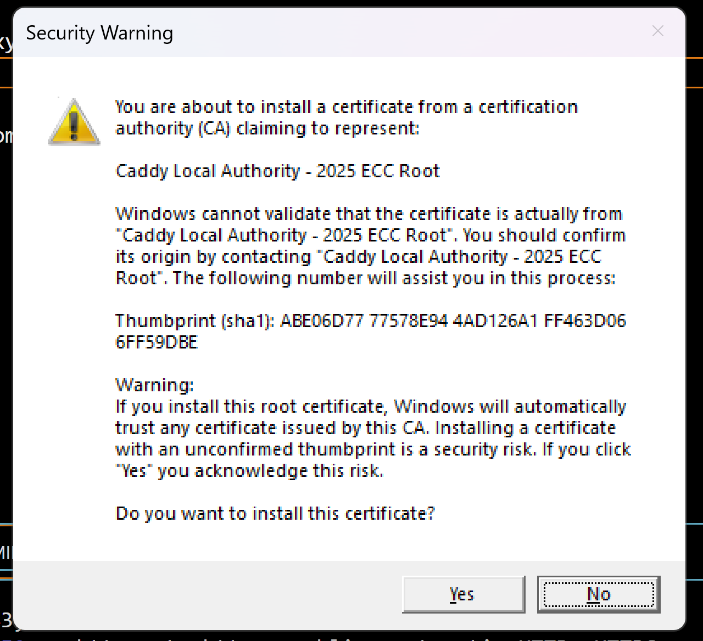

# Research-and-Deployment-of-a-Professional-Portfolio-Web-Server
In this assignment, I researched the Caddy web server, deployed it locally and on the cloud, and build my professional portfolio website. The portfolio showcases a professional resume and at least two completed projects.


## Part 2: Local Deployment and Portfolio Setup Report

### Local Deployment Process

#### Step 1: Installing Caddy
I followed these steps to install Caddy on my Windows machine:

1. Visited the Caddy Releases Page on Github (https://github.com/caddyserver/caddy/releases)
2. Found the latest release and expanded the "Assets" section
3. Downloaded caddy_2.9.1_windows_amd64.zip
4. Extracted the ZIP file
5. Copied caddy.exe from the extracted folder
6. Navigated to C:\Windows\System32
7. Pasted caddy.exe (provided administrator permissions when prompted)
8. Opened Command Prompt and verified installation with `caddy run`


>[!IMPORTANT]
>Make sure to click yes here



#### Step 2: Basic Caddy Configuration
Created my Caddyfile with the following configuration:
```
:2000 {
    root * "C:/Users/henry/Documents/BCIT CIT TERM 3/ACIT 3475 Web Server Admin/Project 1/Portfolio website"
    file_server
    handle /api/* {
        reverse_proxy localhost:3000
    }
}
```

Here's what each part does:
- `:2000` - Sets the port where the server listens
- `root *` - Specifies the root directory for serving files
- `file_server` - Enables Caddy's built-in file server
- `handle /api/*` - Creates a route for API requests
- `reverse_proxy localhost:3000` - Forwards API requests to a local backend server

This configuration allows me to:
1. Serve static files from my portfolio directory
2. Handle API requests through a separate backend service
3. Test everything locally on port 2000

#### Verifying Caddy Server Deployment
I verified that Caddy was running correctly by inspecting the server headers:

1. Opened my website at http://localhost:2000/
2. Used browser Developer Tools (F12)
3. Went to the Network tab
4. Reloaded the page to capture requests
5. Inspected the response headers

Here's what the network inspection revealed:
```
Request URL: http://localhost:2000/
Request Method: GET
Status Code: 200 OK
Remote Address: [::1]:2000
Server: Caddy
```


This confirms that Caddy is properly serving my website.

#### Step 3: Portfolio Development
Built my portfolio website using:
- HTML5 & EJS templates
- CSS3 for styling
- JavaScript for interactivity


### Challenges and Solutions

1. **Port Binding Issues**
   - Challenge: Initial port 80/443 conflicts
   - Solution: Switched to port 2000 for development

### Troubleshooting Guide

#### Common Issues and Solutions

1. **Caddy Won't Start**
   ```bash
   # Check Caddy status
   systemctl status caddy
   # View Caddy logs
   journalctl -u caddy --no-pager
   ```
   - If port conflicts: Change port in Caddyfile
   - If permission errors: Check file ownership with `ls -la`

2. **Backend Service Issues**
   ```bash
   # Check Node.js service status
   systemctl status portfolio-backend
   # View backend logs
   journalctl -u portfolio-backend --no-pager
   ```
   - If service crashes: Check for missing dependencies
   - If connection refused: Verify port 3000 is available


### Conclusion
Successfully deployed Caddy locally and set up a basic portfolio website structure. The process helped me understand web server configuration and deployment workflows.


## Part 3: Cloud Deployment and Domain Setup

### Step 1: Preparing the Cloud Environment
1. Created AWS EC2 instance:
   - Ubuntu Server 22.04 LTS
   - t2.micro (free tier)
   - Selected existing key pair
   - Security Groups:
     - HTTP (80)
     - HTTPS (443)
     - SSH (22)

2. Connected to instance:
```bash
ssh -i existing-key.pem ubuntu@[ec2-ip]
```

### Step 2: Setting Up the Web Server and Domain
1. Installed Caddy and followed welcome page instructions:
```bash
sudo apt update && sudo apt install -y caddy
```

2. Domain Registration and DNS Setup:
   - Purchased 'henry-wong.site' domain from Namecheap
   - Created AWS Route 53 hosted zone
   - Added A record pointing to EC2 IP
   - Configured nameservers in Namecheap to point to Route 53

3. Installed Node.js :
```bash
sudo apt install -y nodejs

# Verify installation
node --version
npm --version
```

4. Followed Caddy's welcome page setup guide:
   - Created web root: `sudo mkdir -p /var/www/html`
   - Set permissions: `sudo chown -R ubuntu:ubuntu /var/www/html`
   - Modified Caddyfile at `/etc/caddy/Caddyfile`:
     - Replaced `:80` with `portfolio.henry-wong.site`
     - Set root to `/var/www/html`
   - Reloaded config: `sudo systemctl reload caddy`

5. Cloned portfolio:
```bash
cd /var/www/html
git clone [my-repository] .
```

6. Configured Caddyfile for domain and automatic SSL:
```
portfolio.henry-wong.site {
    root * /var/www/html
    file_server
    handle /api/* {
        reverse_proxy localhost:3000
    }
}
```

### Step 3: Configuring the Server
1. Backend setup:
```bash
cd backend
npm install
```

2. Created Node.js service:
```bash
# /etc/systemd/system/portfolio-backend.service
[Unit]
Description=Portfolio Backend Node.js Server
After=network.target

[Service]
Type=simple
User=ubuntu
WorkingDirectory=/var/www/html/backend
ExecStart=/usr/bin/node /var/www/html/backend/server.js
Restart=on-failure
Environment=NODE_ENV=production

[Install]
WantedBy=multi-user.target
```

3. Enabled and started the service:
```bash
sudo systemctl enable portfolio-backend
sudo systemctl start portfolio-backend
sudo systemctl status portfolio-backend  
```

### Challenges and Solutions
1. **Secure Connection Issues**
   - Challenge: Caddy not detecting index file
   - Solution: Recreated directory structure following Caddy's documentation

2. **Missing Dependencies**
   - Challenge: Backend dependencies missing after git clone
   - Solution: Reinstalled with npm install
   


3. **Server Management**
   - Challenge: Figure out how to keep server.js running
   - Solution: Implemented systemd service

### Final Deployment
Successfully deployed at https://portfolio.henry-wong.site with:
- Secure HTTPS connection
- Running Node.js backend
- Proper domain resolution through Route 53


### Conclusion
The cloud deployment phase successfully achieved all tasks. AWS EC2 provided the hosting environment, Route 53 handled domain management, and Caddy managed HTTPS certification. The implementation of systemd services ensures reliable backend operation. This deployment demonstrates effective use of cloud infrastructure and web server technologies.


